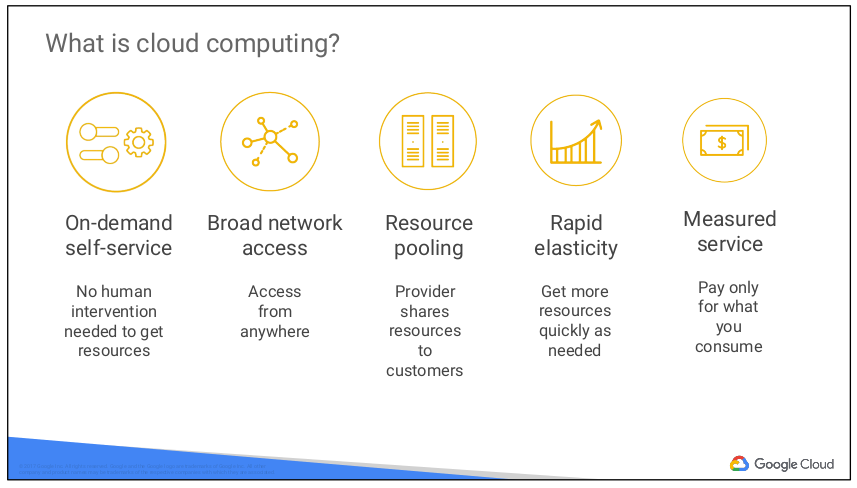
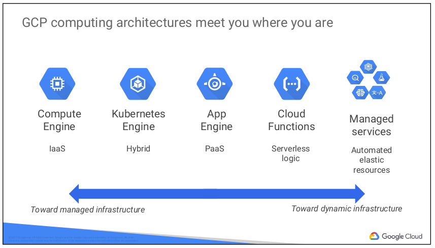
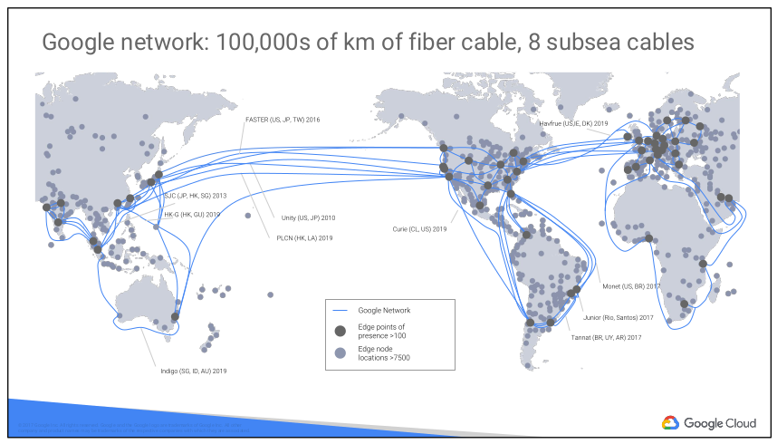
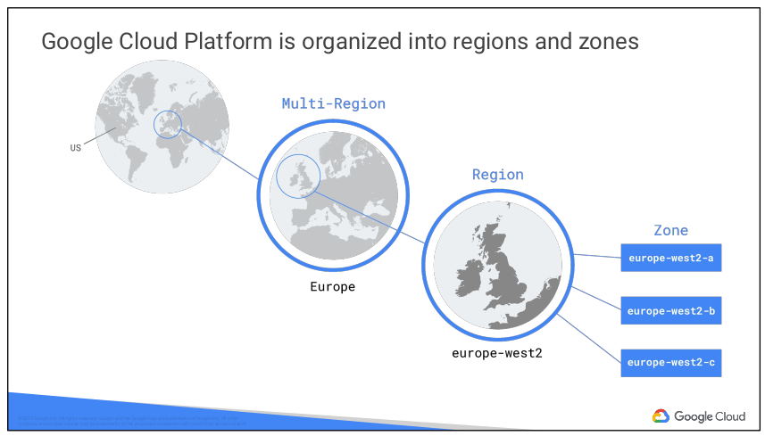
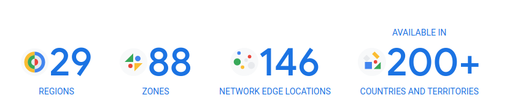
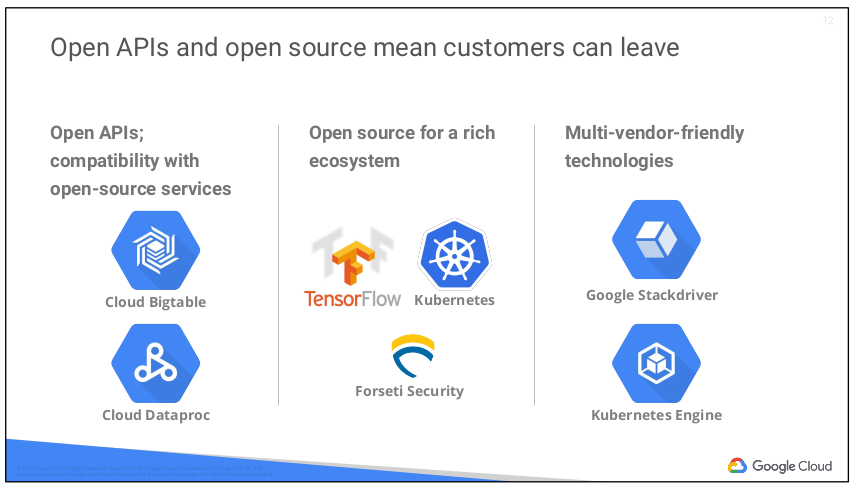
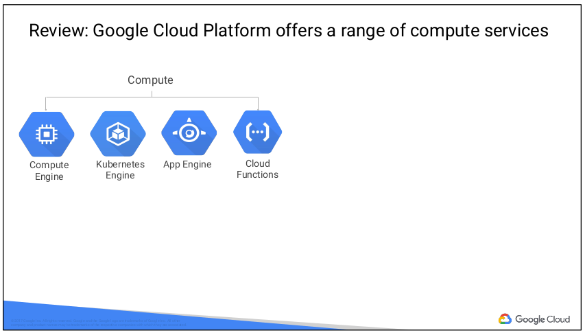
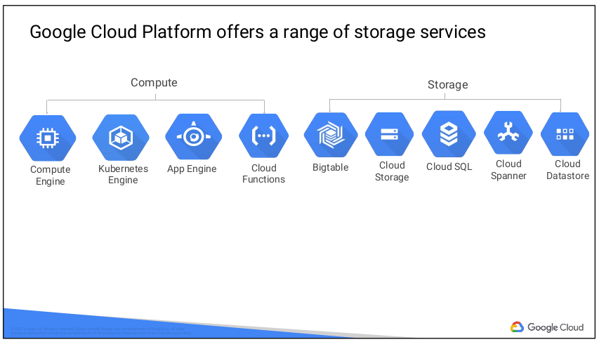
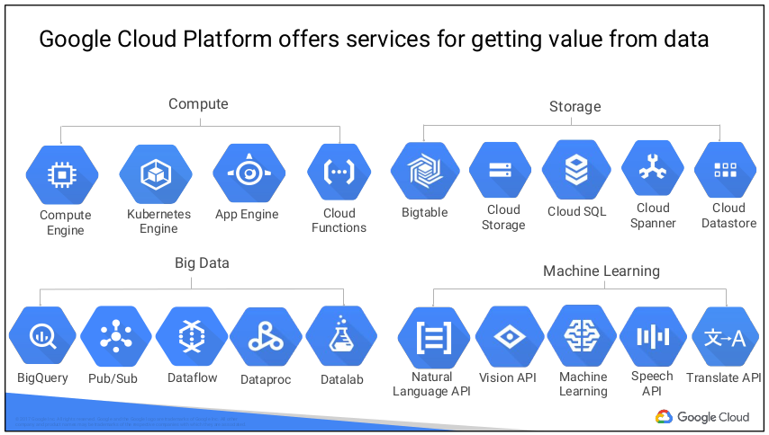

# 01. Introducing GCP
## GCP main services
- Compute
- Storage
- Big Data
- Machine Learning

이 과정에서는 Compute, Storage + networking 에 초점을 맞춤
  

## What is Cloud Computing?
 
아래 5가지 특징을 갖는다.
- On-demand self-service
  - 필요할 때, 필요한 만큼 리소스를 사용할 수 있음
- Broad network access
  - 어디서든지 접속할 수 있음
- Resource pooling
  - 공급자는 대량의 리소스 풀을 통해 규모의 경제를 실현
  - 고객에게 리소스 풀에서 서비스 제공
  - 고객은 리소스에 대해 걱정할 필요 없음
- Repid elasticity
  - 리소스가 탄력적(Elastic)
  - 리소스가 더 필요하면, 더 사용하면 되고
  - 덜 필요하면, 사용량을 축소시키면 된다; scale back
- Measured service
  - 고객은 사용거나 점유한 만큼만 비용을 지불
  

## GCP Computing Architectures
 
가상화된 데이터 센터
- IaaS; Infrastructure as a Service
  - raw compute, storage, network 제공
  - 할당한 리소스에 대해 비용 지불
- Paas; Platform as a Service
  - 고객은 applications 개발에만 집중
  - 나머지 infrastructures 는 Platform 으로 제공
  - 사용한 리소스에 대해 비용 지불

현재 cloud 는 infrastructures 와 services 를 관리하는 것에 중요하게 생각함

- SaaS; Software as a Service
  - Search, Gmail, Docs 같은 applications
  - 하지만, 이 과정에서는 다루지 않음
  

## Google Network
 
- Google 은 highest throughput, lowest latencies 를 보장하기 위해 많은 투자를 하고 있음
- Google 의 edge caching network sites 를 통해 사용자에게 lowest latency 를 제공함
  

## GCP regions and zones
 
- zones
  - Google Cloud Resources 가 배포되는 지역
  - 예를 들어, Compute Engine 을 사용하는 GCP 에서 virtual machine 을 동작시킨다면, VM 은 특정 zone 에서 실행됨
  - zone 이 GCP Data Center 라고 생각할 수 있지만, 딱히 그런것은 아님
  - 하나의 zone 이 하나의 물리적인 건물에 매팽되는 것은 아님
  - zones 들은 지리적으로 독립적인 regions 으로 그룹화됨
  - GCP 리소스를 어떤 regions 에 둘 것인지 선택할 수 있음
  - a region 에 있는 모든 zones 은 서로 간에 가장 빠른 네트워크로 연결됨
  - regions 안에 위치는 보통 5ms 이하의 네트워크 RTT 를 가짐
  - a zone 을 a region 안에 하나의 장애 도메인으로 생각하면 됨
  - fault tolerant application 을 만드는 일환으로, resources 를 하나의 region 안의 여러 개 zones 에 분산시킬 수 있음
  - 다른 여러 regions 에서 resources 를 실행 시킬 수 있음
  - 예를 들어, Google Cloud Storage 는 유럽의 Multi-Region 내에 데이터를 두어 자연 재해 같은 region 전체에 발생할 수 ㅣㅇ슨 장애에 대응할 수 있음
  - 즉, 최소 2군데 이상의 지리적으로 160km 이상 떨어진 유럽내에 다른 위치에 데이터를 중복으로 저장함
  - 현재 GCP 는 29 개 regions 을 운영함
  - 
  

## Open APIs and open sources
 
특정 클라우드 vendor 에 locked-in 되지 않아도 됨
- 다른 open sources 와 호환성을 위해 Open APIs 제공
  - Google Cloud Bigtable
    - Apache HBse interface 를 사용하여 코드 이식성을 높임
  - Cloud Dataproc
    - 오픈 소스 Hadoop 을 관리형 서비스로 제공
- Open Sources
  - Machine Learning 을 위한 TensorFlow
- Interoperability(상호 운용성)
  - Kubernetes
    - 다른 클라우드에서 실행되는 microservices 를 혼합하고 매칭하는 기능 제공
  - Google Stackdriver
    - 여러 클라우드 업체의 워크로드를 모니터링할 수 있음
  

## Why choose Google Cloud Platform
Services Google Cloud Platform offers 

  
  

## Multi-layered security approach
[Google Infrastructure Security Design Overview](https://cloud.google.com/security/infrastructure/design/) 
- Google 은 H/W 보안 chip; Titan 을 독자적으로 설계하여 서버와 주변장치에 사용 중
- Google 서버는 cryptographic signatures 를 사용하여 올바른 소프트웨어가 부팅되도록 함
- Google 서버는 여러 계층의 물리적인 보안을 포함하는 데이터 센터를 설계하고 구축함
- 아주 극히 일부분의 Googler 만 데이터 센터에 접근 가능
- Google 인프라는 Google services 간에 통신하는 data-on-the-network 라고 불리는 원격 호출에 대해 암호화된 개인정보 보호와 무결성을 제공함
- 인프라는 데이터 센터간에 전송되는 사용자 트래픽을 자동적으로 암호화함
- Google Central Identity Service 는 사용자에게 Google log-in 페이지로 username 과 password 를 물어보는 것 뿐만 아니라, 위험 요소를 기반으로한 추가적인 정보를 요구한다. 예를 들어, 동일한 기기로 로그인 했는지 혹은 지난날 동안 같은 장소에서 로그인 했는지
- 사용자는 U2F 표준인 universal second factor 기반의 장치로 sign-in 할 때 second factors 를 사용할 수 있음
- 대부분의 Google 의 어플리케이션은 storage services 를 통해서 간접적으로 물리적인 스토리지에 접근하며, 이런 서비스에 대해 암호화가 설계됨
- Google 은 HDD 와 SSDs 에 대해 H/W 암호화를 지원함
- Google Front End(GFE) 는 올바른 인증서로 들어오는 네트워크 연결이 됐는지 체크함
- GFE DoS(Denial of Services) 에 대한 보호도 제공
- Google 인프라 내부에서 machine intelligence 가 예상되는 위험을 미리 경고해줌
- Google 은 admin 권한을 가진 직원들의 활동을 적극적으로 모니터링하고 제한함
- Google 직원에 대한 피싱 공격을 막기 위해서, Googler 계정에는 U2F 호환 보안 키를 요구함
  

## Bugets and Billing
Google 은 비용에 관해 4가지 툴을 제공
- budgets and alerts
  - budgets 을 계정마다 혹은 GCP 프로젝트마다 설정할 수 있음
  - budgets 은 limit 을 고정 시키거나
  - 혹은 지난 달 비용의 몇 퍼센트로 설정할 수 있음
  - budgets limit 에 도달하면 alert 가 발생함
- billing export
  - 상세 비용 정보를 저장해서 어떤 서비스가 많은 비용을 발생시켰는지 알 수 있음
- reports and quotas
  - 시각화 툴로 GCP console 에서 비용을 모니터링할 수 있음
  - 한도(quota) 를 설정할 수 있음
    - Rate quota
      - 100 초 동안 최대 1000 개 API 요청 처리 한도
    - Allocation quota
      - 프로젝트 당 할당하는 리소스 개수 한도를 설정
      - 예를 들어, 프로젝트마다 최대 5개 VPC(Virtual Private Cloud) 를 설정

