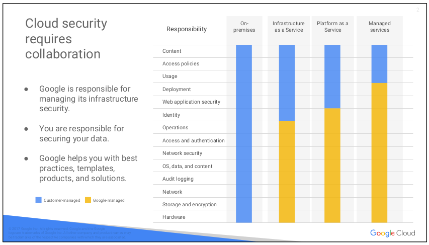

# 02. Getting started with Google Cloud Platform

## Module Introduction
 

IAM(Identity and Access Management)
- 어떤 사용자가 무엇을 할 수 있는지 제어
- 일반적으로 GCP 에서 사용하는 리소스는 공통 비지니스 목적과 원칙을 가지고 있어서 관련된 리소스끼리 그룹화해서 사용하게 됨
- 따라서 권한(privilege) 를 부여하고 관리하는 것이 매우 중요
- 온프레미스 혹은 클라우드 모두 이런 권한은 아주 소수의 사람만 가지고 있어야 함
- root user 로 잘못해서 데이터베이스를 모두 삭제할 수도 있음
  

GCP 관리 레이어는 4가지 방식이 있음
1) web 기반의 콘솔
2) SDK
3) API 를 사용하는 CLI(Command Line Tools)
4) 모바일 앱
  

- 보통 web 기반의 콘솔이나 CLI 를 사용하게 될 것임
- on-premises 환경에서는 모든 보안을 내가 직접 신경써야 한다.
- 하지만 Google Cloud 는 IaaS, PaaS, Saas 특징 마다 layers 별로 보안을 제공
- IAM 에서는 이런 layers 마다 보안과 권한 설정을 할 수 있도록 해줌

## The Google Cloud Platform resource hierarchy
[Resource hierarchy](https://cloud.google.com/resource-manager/docs/cloud-platform-resource-hierarchy) 
 

- GCP 에서 모든 리소스는 projects 안에 구성됨
  - Virtual Machines, Cloud Storage bucket, tables in BigQuery, anything else
- projects 는 folders 안에 구성될 수 있음
  - folders 는 다른 folders 를 포함할 수 있음
- 모든 folders 와 projects 는 organization code 아래 합쳐질 수 있음
- Projects, folders, organization nodes 모두 정책(policies)을 정의할 수 있음
- 어떤 GCP 리소스는 개별 리소스에 policeis을 설정할 수 있음
  - Cloud Storage buckets
- Policies 는 계층구조에서 아래 방향으로 상속됨
  

 
모든 Google Cloud Platform 리소스를 Google Cloud Platform Console project 에 속함
- Projects 는 GCP 서비스를 사용하는데 가장 기본이 됨
  - APIs 를 관리하고, 요금을 활성화하고, 같이 일하는 동료를 추가/삭제, 다른 Google 서비스를 사용
- 각 projects 는 별도 구획으로 나뉘며, 각 리소스는 정확히 하나에 속함
- Projects 는 다른 소유자와 사용자가 있을 수 있음
- Projects 마다 달리 요금이 청구되며, 별로도 관리됨
  

Cloud Resource Manager 는 Google Cloud Platform 에서 projects 를 API 프로그래밍으로 관리하게 해줌
- 계정에 관련된 모든 프로젝트 목록을 가져오기
- 새로운 프로젝트 생성
- 기존 프로젝트 업데이트
- 프로젝트 삭제
- 삭제했던 프로젝트 복구
  

Cloud Resource Manager 는 RPC API, REST API 2가지로 접근할 수 있음 
[APIs and reference](https://cloud.google.com/resource-manager/docs/apis) 
  

 
- GCP project 는 이름(name)과 project ID 를 가짐
- project ID 는 영구적이고 변경되지 않는 식별자(identifier)로 GCP 전체에서 unique 함
- GCP 에게 project ID 로 어떤 프로젝트를 작업할 것인지 알려줘야 함
- 반면에, 프로젝트 이름은 편의를 위한 것으로 변경 가능함
- GCP 는 프로젝트마다 유일한 프로젝트 번호(number) 를 할당함
- 하지만, 이 과정에서 project number 를 다루진 않음
- 일반적으로 project ID 는 사람이 읽을 수 있는 문자열로, 프로젝트를 참조하는데 많이 사용

 
- Cloud IAM Folders 기능은 레벨 단위로 리소스에 정책(policies) 를 할당할 수 있음
- folder 안에 리소스는 IAM policies 상속 받음
- folder 는 projects 와 folders 를 포함할 수 있음
- folders 를 계층 구조에서 조직(organization) 아래 projects 를 그룹화할 수 있음
- 예를 들어, 당신의 조직이 여러 개의 부서를 가지고 있고, 각 부서는 자신의 GCP 리소스를 가질 수 있음
- Folders 는 부서 별로 이런 리소스를 그룹화 시킬 수 있음
- Folders 를 통해서 팀은 관리 권한을 위임해서 독립적으로 작업 가능함
  

- Folder 안에 리소스는 folder 로부터 IAM policies 를 상속받음
- 예를 들어, 위 그림에서 Folder B 에 IAM policies 를 두고 project 3 와 project 4 관리하는 것이 효과적임
- 주의 : folders 를 사용하기 위해서는 계층 구조 최상위에 organization 노드가 있어야 함
  

 
- 당신의 회사의 모든 프로젝트를 하나의 구조로 조직화하고 싶을 수 있음
- 대부분의 회사는 리소스가 어떻게 사용되는지 중앙 집중화된 시각화를 원할 것이고
- 따라서, policies 도 중앙에서 적용할 수 있길 원할 것임
- 이게 조직(organization) 노드의 역할이고, 계층 구조 상 최상위에 존재함
  

 
- organization 노드의 특별한 역할
  - 예를 들어, 당신이 organization 정책 관리자가 되어, 
  - 오직 소수의 사람만이 권한을 가지고 policies 를 변경할 수 있게 할 수 있음
  - 또한, project 생성 역할(role) 권한을 부여해서, 비용 지출을 관리할 수 있음
- organization 노드는 회사가 G Suite 고객인지 여부에 따라 다르게 사용할 수 있음
  - G Suite 고객인 회사의 GCP 프로젝트는 자동적으로 organization 노드에 속함
  - 그렇지 않으면 Google Cloud Identity 를 사용해서 생성해야 함
- organization 노드가 있으면 그 아래 folders 를 만들고 그 안에 projects 를 넣을 수 있음
  

 
리소스를 구성하는 계층 구조 예제
- 리소스는 부모 리소스의 정책(policies)를 상속함
  - 예를 들어, organization 레벨에서 정책을 설정하면, 모든 자식 projects 에게 상속됨
  - 또한, 그 아래 리소스도 정책을 상속받음
- `중요:` 계층 구조 하위에서 상위 레벨의 권한을 제거할 수 없음
  - 예를 들어, `bookshelf` 프로젝트에 적용된 정책이 사용자 `Pat`에게 Cloud Storage bucket 을 수정할 수 있는 권한을 준다고 가정할 때
  - 그러나 organization 수준의 정책에 따라 `Pat` 이 Cloud Storage bucket 의 read 권한만 주어진다면, 결국 `Pat` 은 최종적으로 read 권한 밖에 사용할 수 없음
  

## Identity and Access Management (IAM)
 
IAM 은 관리자가 어떤 사람이 어떤 리소스에 어떤 동작을 할 수 있는지 권한을 부여함 
IAM 은 "who", "can do what", "on which resource" 부분으로 나뉨 
[Identity and Access Management(IAM)](https://cloud.google.com/iam/) 
  

### "who" part of IAM
 
IAM 정책의 "who" 부분은 Google 계정, Google group, service 계정 혹은 G Suite 전체 혹은 Cloud Identity domain 이 될 수 있음 
  

### "Can do what" part of IAM
 
"can do what" 부분은 IAM 정책에 의해 정의됨
- IAM 정책은 권한(permisions)의 집합
- 대부분, 1 개의 권한만 필요
- 하지만, project 의 인스턴스를 관리하기 위해서는, 인스턴스를 create, delete, start, stop, change 할 필요 있음
- 따라서, 권한들을 모아서 하나의 정책으로 만들어 쉽게 관리함
  

### "On which resource" part of IAM
 
사용자, 그룹, 서비스 계정에 리소스 계층 구조의 특정 요소에 대한 정책을 줄 때, 그 요소 뿐만 아니라 그 하위 계층에도 정책이 적용됨 
  

### 3가지 유형의 IAM roles
 
[Understanding roles](https://cloud.google.com/iam/docs/understanding-roles)   
 
- Primitive 정책은 광범위해서 GCP project 에 적용
- project 의 모든 리소스에 적용됨
  

 
IAM primitive 정책은 고정되고 대략적인 접근 레벨을 제공
- Owner, Editor, Viewer 정책
  - viewer 는 리소스를 볼 수만 있고, 변경할 수 없음
  - editor 는 viewer 권한 + 리소스의 상태를 변경할 수 있음
  - owner 는 editor 권한 + 리소스의 정책과 권한을 관리할 수 있음
  - project 의 owner 는 비용(billing) 에 대해 설정할 수 있음
  - 프로젝트의 리소스에 대한 권한 없이, 비용을 관리하는 비용 관리자 정책을 부여할 수도 있음
- GCP IAM 은 좀 더 세분화된 정책 유형을 제공함
  

 
GCP 서비스는 predefined 정책을 제공함
- 예를 들어, 서비스로 virtual machine 을 제공하는 Compute Engine 의 경우, predefined 정책을 제공해서 Compute Engine 을 사용하는 project, folder, organization 에 적용시킬 수 있음
- 다른 예로, 관리형 데이터베이스 서비스인 Cloud Bigtable 은 organization, 특정 프로젝트 혹은 Bigtable 데이터베이스 인스턴스 각각에 적용할 수도 있음
  

 
- Compute Engine 의 instanceAdmin 정책은 누구든지 virtual machine 에서 특정 동작들을 수행할 수 있게 해줌
  - 목록 보기, 환경설정 읽거나 변경, 시작과 정지
- 예제 화면에서 Google Group 의 모든 사용자는 instanceAdmin 정책을 가지고 있고 project A 에서 모든 virtual machines 에 사용할 수 있음
  

 
좀 더 세분화된 정책을 원한다면? custom roles 을 사용하면 됨
- 대부분의 회사는 "최소한의 권한" 모델을 사용함
- 예를 들어, Compute Engine virtual machines 을 시작하고 중지할 수 있는 권한은 주되, 재설정하는 것은 금지하는 "instacneOperator" 정책을 정의하고 싶다면, Custom Role 을 사용하면 됨
- 다만, Custom Role 은 project 혹은 organization 레벨에서만 사용할 수 있음
- folder 레벨은 안됨
  

### Service Account
 
- service account 는 사람이 아니라 Compute Engine virtual machine 같은 서비스에 권한을 줄 수 있음
- 예를 들어, Google Cloud Storage 에 데이터를 저장하는 어플리케이션이 virtual machine 에서 동작한다고 가정하자
- 인터넷에 접근하는 그 누구가 아니라, 오직 그 virtual machine 에게만 접근 권한을 부여하고 싶다면?
- service account 를 생성해서 VM 에 권한을 주면 됨
- service accounts 는 email 주소로 이름이 되어 있지만, password 가 아니라 보안키로 리소스에 접근함
  

 
- 이 예제에서는, service account 에 Compute Engine 의 InstanceAdmin Role 이 부여되었음
- 이렇게 하면, service account 를 가진 VM 에서 실행 중인 어플리케이션이 다른 VM 을 생성, 수정, 삭제 할 수 있음
- service account 도 관리되어야 함
- service account 는 ID 이면서 리소스가 됨
- 따라서, IAM 정책을 추가할 수 있음
- 예를 들어, Alice 는 service account 에 editor role 을 가지고
- Bob 은 viewer role 을 가질 수 있음
- 다른 GCP 리소스에 roles 를 부여하는 것과 동일함
  

 
- 프로젝트에 서로 다른 VM 그룹에 다른 식별자(identifiers) 를 부여할 수 있음
- 각 그룹에 다른 권한을(permissions) 을 관리하기 쉬움
- VM 을 재생성할 필요 없이 service accounts 의 권한을 변경할 수 있음
- 위 그림의 예제처럼, 하나의 프로젝트 내부에 여러 개 Compute Engine VM 그룹이 있다고 할 때, 그룹 별로 service account 를 만들고 권한을 다르게 주어, 그룹 간에 영향을 받지 않게 함
  

## Cloud Identity
 
- 일반적으로, Gmail 계정으로 GCP 콘솔에 로그인해서 개발을 시작함
- 누가 팀을 떠나게 되면, 곧바로 권한 회수가 어려울 수 있음
- G Suite
  - G Suite 를 사용하면, G Suite 사용자와 그룹에 대해서 GCP 정책을 정의할 수 있음
  - admin 이 곧바로 특정 계정을 비활성화하고 그룹에서 삭제 가능함
- Cloud Identity
  - G Suite 를 사용하지 않는 경우, Cloud Identity 로 대체할 수 있음
  - Cloud Identity 는 Google Admin Console 에서 사용자와 그룹을 관리할 수 있게 함
  - Cloud Identity 는 무료이지만, premium edition 을 사용하면 모바일 장치 관리도 가능함
  

 
- Google Cloud Directory Sync 를 사용하면, 이미 사용중이던 계정 이름과 패스워드로 관리자가 로그인해서 GCP 리소스를 관리할 수 있음
- Active Driectory 혹은 LDAP 시스템에서 사용자와 그룹을 동기화시킬 수 있음
- 동기화는 단 방향으로만 동작함
  

## Interacting with Google Cloud Platform
 
4 가지 방법으로 GCP 사용할 수 있음
- Console
- SDK & Cloud Shell
- Modile App
- APIs
  

### Google Cloud Platform Console
 
- Google Cloud Source Repositories 는 git, editor, 협업 툴을 제공
- Google Cloud Shell 은 브라우저에서 CLI 를 제공
  - Cloud SDK gcloud command 와 유틸리티 제공
- [Cloud Console](https://cloud.google.com/cloud-console/)
  

### Google Cloud SDK
 
- Google Cloud SDK 는 툴 모음으로 GCP 에 호스팅되는 어플리케이션과 리소스를 관리하는데 사용함
  - gcloud tool
    - CLI 제공
  - gsutil, bq
- [Cloud SDK](https://cloud.google.com/sdk/docs/initializing)
- [App Engine SDK](https://cloud.google.com/appengine/downloads)
- [Cloud Shell](https://cloud.google.com/shell/docs/)
  

### RESTful APIs
 
- REST(Representational state transfer) API 를 제공
- JSON 으로 데이터 전달
- OAuth2 로 사용자 로그인과 접근 제어
- [Cloud APIs](https://cloud.google.com/apis/)
  

### APIs Explorer
 
- APIs Explorer 는 브라우저에서 사용하는 interactive tool
  

### Client Libraries
 
- Cloud Client libraries
  - Google Cloud 의 최신의 권장하는 API 라이브러리
- Google API Client library
  - Cloud Client libraries 가 최신 서비스와 기능을 지원하지 않는 경우 대체하여 사용
  

### Cloud Console Mobile App
 
- SSH 로 Compute Engine 인스턴스를 시작, 중지, 로깅을 확인할 수 있음. 
- SQL 인스턴스를 시작, 중지할 수 있음
- 프로젝트 비용 정보를 보거나 예산을 넘어가면 비용 알림을 받을 수도 있음
- CPU, network, requests per second, server 에러 등도 볼 수 있음
- [Console App](https://cloud.google.com/console-app/)
  

## Cloud Marketplace
 
- GCP 에 동작하는 소프트웨어 패키지를 빠르게 배포할 수 있음
- 수동으로 소프트웨어, VM, 스토리지, 네트워크 설정하지 않고 잘 알려진 소프트웨어 패키지를 시작시킬 수 있음
- Cloud Marketplace 에 있는 많은 소프트웨어 패키지가 무료
- 사용하는데 비용이 청구됨
  

