# 03. Virtual Machines in the Cloud

## Virtual Private Cloud (VPC) Network
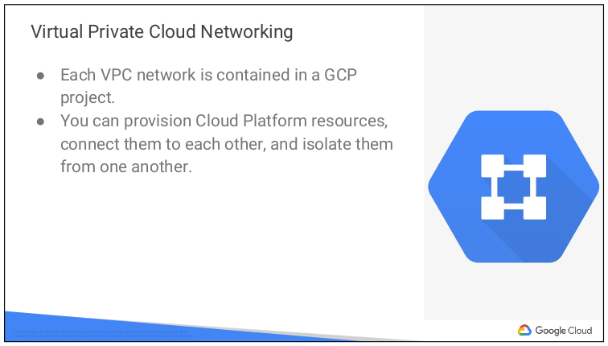 
- VPC 네트워크는 GCP 리소스와 인터넷을 연결함
- 네트워크를 세분화할 수 있고
- 방화벽 규칙으로 인스턴스 접근을 제한할 수 있고
- 특정 목적지에 트래픽을 포워딩하는 정적 라우팅을 생성할 수도 있음
  

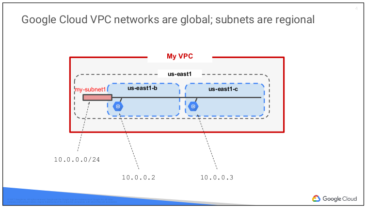 
- Google Virtual Private Cloud 네트워크는 전역 범위로 정의함
- 전 세계 모든 GCP region 에 subnets 이 있을 수 있음
- Subnets 은 region 을 구성하는 zones 에 걸쳐 있을 수 있음
- 다른 zones 의 리소스를 동일 subnet 에 둘 수 있음
- IP 주소 할당 범위를 확장해서 subnet 의 크기를 동적으로 증가시킬 수 있음
  - 이미 설정한 VMs 에 영향을 주지 않음
- 위 그림 예제에서, VPC 는 하나의 네트워크를 가지고 있음
  - GCP 의 us-east1 region 에 하나의 subnet 만 있음
  - 2개의 Compute Engine VMs 이 있는데
  - 이 둘은 다른 zones 에 있음에도 같은 subnet 에 있음

## Compute Engine
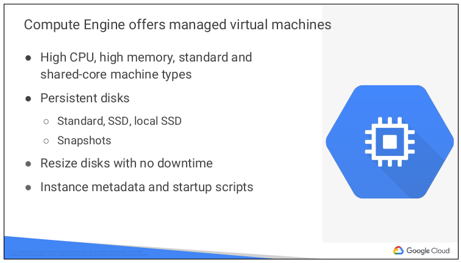 
[Compute Engine](https://cloud.google.com/compute/docs/) 
- 물리적인 서버를 구축하는 것 처럼 virtual machine 을 구성할 수 있음
  - CPU, 메모리, 스토리지 유형과 크기, 운영체제 설정
- Compute Engine 은 Google 인프라에 virtual machine 을 생성하고 동작시킬 수 있음
- 빠르고 일관된 성능을 제공하도록 설꼐된 시스템에 수천개의 CPUs 를 실행할 수 있음
- Compute Engine virtual machines 을 유연하게 재구성할 수 있음
- Google cloud 에서 실행되는 VM 은 전 세계적으로 비교할 수 없는 네트워크 연결성을 제공
- Google Cloud Platform Console 혹은 gcloud CLI 툴로 virtual machine 인스턴스를 생성할 수 있음
- Compute Engine 인스턴스는 Google 에서 제공하는 Linux 및 Windows Server 이미지 혹은 맞춤형 버전의 이미지를 실행할 수 있음
- 또한 다른 운영체제의 이미지를 실행할 수 있음
  

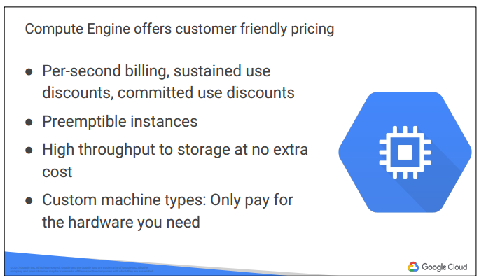 
- Compute Engine 은 최소 1분 동안 사용에 대한 요금이 초당 과금됨
- 한달 내내 실행되는 VM 에 대해 최대 30% 요금 할인 가능
- 약정 할인 가능
  - 워크로드가 예측 가능한 경우 1년 또는 3년의 사용 기간을 약정하면 최대 57% 할인 가능
- Preemptible VMs 
  - 다른 리소스에서 필요한 경우 종료되는 Compute Engine 을 설정해서 비용을 절감할 수 있음
  - 다만, Preemptible VMs 에서 동작하는 job 이 중지되고 재시작하는 것을 명확하게 해야 함
- CPU 개수와 예산에 따라서 어떤 머신을 사용할지 선택 가능
  

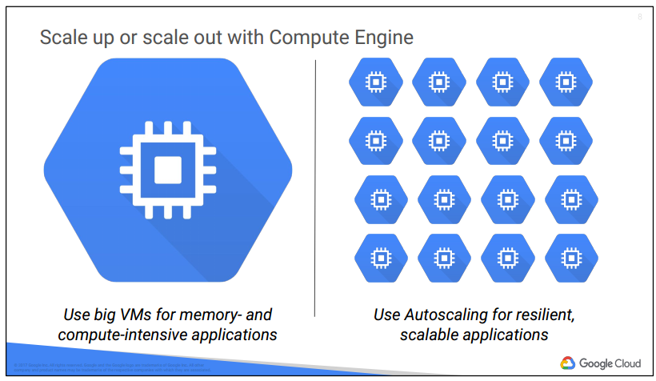 
- 최대 CPUs 96개, Memory 크기 624GB 로 VM 을 설정 가능
  - 워크로드가 아주 큰 in-memory DB 혹은 CPU 가 필요한 분석에 사용 가능
- 하지만 대부분의 사용자는 scale up 이 아니라 scale out 을 
- Autoscaling
  - load metrics 기반으로 VMs 을 추가하거나 제거 가능
  

## Important VPC Capabilities
[How-to guides](https://cloud.google.com/vpc/docs/how-to) 
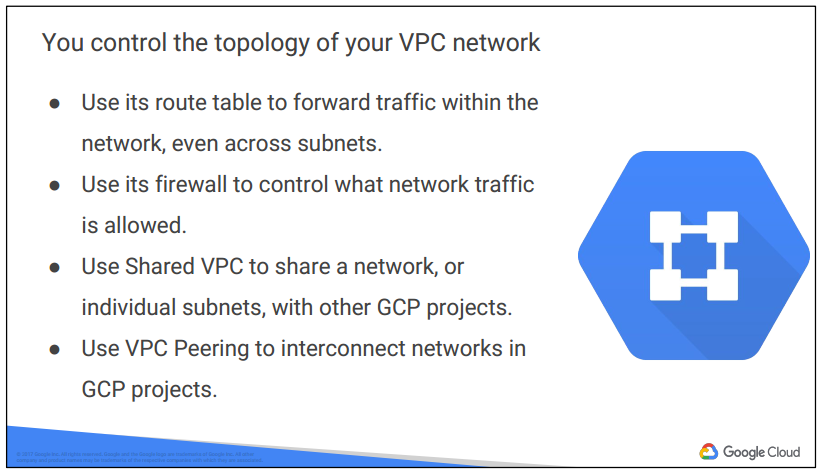 
- VPC routing tables
  - 인스턴스에서 다른 인스턴스로 트래픽을 보냄
  - GCP zones 에서 같은 네트워크 혹은 다른 네트워크로
  - VPC 간 routing tables 은 built-in 으로 사용자가 수정할 필요 없음
- firewall
  - 인스턴스에 접근하는 incoming, outgoing 트래픽을 제어
  - metadata tags 에 관한 방화벽 규칙 정의 가능
  - 예를 들어, port 80 혹은 443만 허용하는 "WEB" 이라는 tag 를 만들어서 모든 VMs 에 "WEB" tag 를 설정하여 트래픽을 제어할 수 있음
  

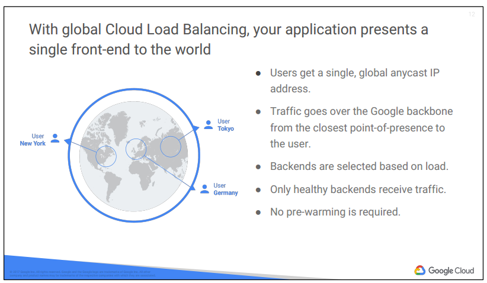 
- Cloud Load Balancing
  - 모든 트래픽에 대해 완전 분산형, software-defined, 관리형 서비스 제공
  - load balancer 는 사용자 VM 에서 동작하는 것이 아니기 때문에 신경쓸 필요 없음
  - 모든 트래픽의 앞단에 Cloud Load Balancing 을 두면 됨
  - cross-region 에 대해 load balancing 제공
  

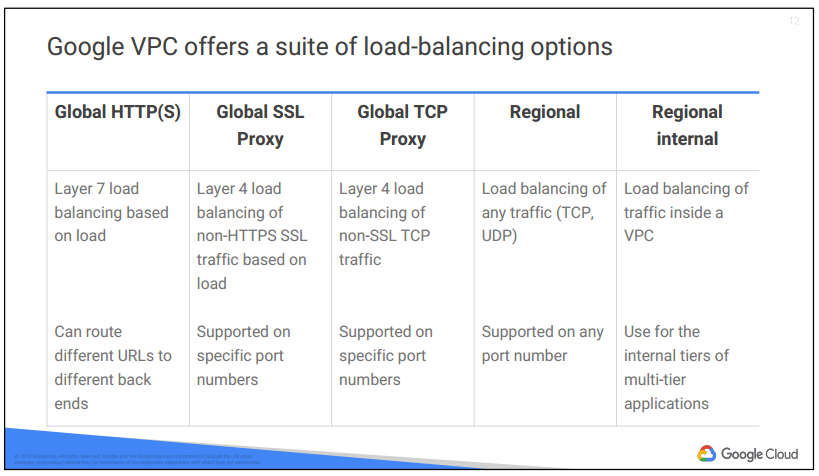 
- Load Balancer 는 Internet 에서 GCP 네트워크로 들어오는 트래픽을 제어
- HTTPs load balancing
  - Web 앱이 cross-regional load balancing 필요할 때
- Global SSL Proxy Load Balancer
  - HTTP 는 아니면서 Secure Socket Layer 트래픽일 때
  - TCP 이면서 port 443 
- Global TCP Proxy Load Balancer
  - TCP 인데 Secure Socket Layer 는 아닌 트래픽일 때
- Regional Load Balancer
  - GCP regions 에 걸쳐서 UDP 트래픽, 혹은 port number 로 트래픽을 조절할 경우
- Internal Load Balancer
  - 사용자 프로젝트 내부에서(presentation layer 와 business layer 간에) 사용하고 싶을 때
  - GCP 내부 IP 주소의 트래픽
  - Compute Engine VMs 간의 트래픽
  

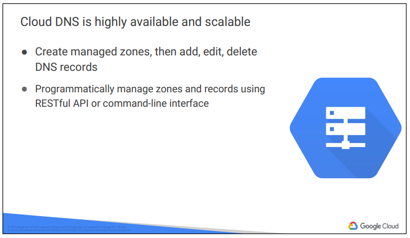 
- Google 은 8.8.8.8 주소로 공짜 DNS(Domain Name Service) 를 제공
- DNS
  - Internet 호스트 이름을 IP 주소로 변환
- Cloud DNS
  - GCP 내부 applications 의 호스트 이름과 IP 주소를 찾을 수 있게 해줌
  - 관리형 DNS 서비스
  - low latency & high availability
  - programmable
    - GCP console 로 DNS zones 과 records 를 관리하고 배포 가능
  

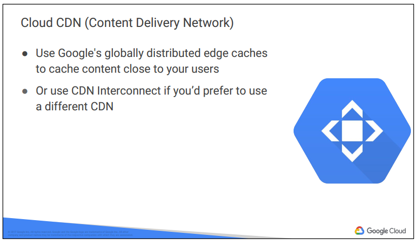 
- Google Cloud CDN
  - content delivery 를 가속화
  

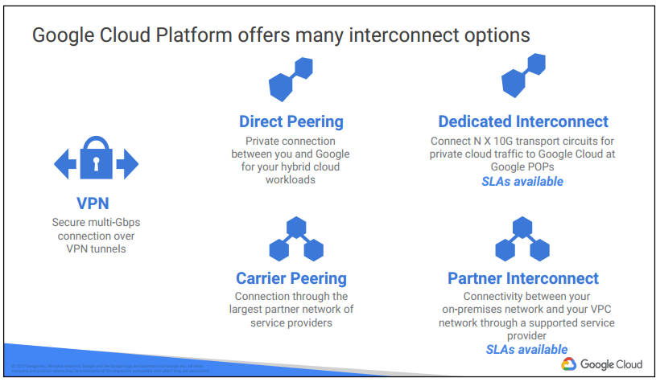 
- 사용자가 기존에 보유한 cloud 혹은 on-premises 와 GCP 를 연결
- Cloud Router
  - Google VPC 와 사용자 VPN 간에 라우팅 정보를 교환하게 해줌
  - Border Gateway Protocol 사용
- Direct Peering
  - 보안과 안정된 대역폭을 위해 인터넷 접속 없이 네트워크를 구성하고 싶을 때
  