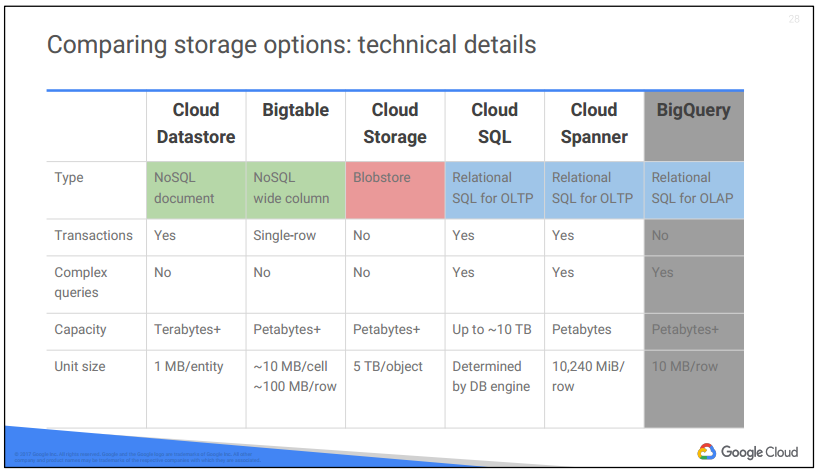

# 04. Storage in the Cloud
 
GCP 의 다양한 storage options
- Cloud Storage
- Cloud SQL
- Cloud Spanner
- Cloud Datastore
- Cloud Bigtable
  

## Cloud Storage
 
- Cloud Storage 는 고가용성의 object storage 제공
- [What is object storage?](https://cloud.google.com/learn/what-is-object-storage)
  - 비정형 데이터의 대규모 저장소를 위한 데이터 스토리지 아키텍처
  - 데이터 조각을 object 로 지정해서 별도의 창고(storehouse) 에 보관
  - 쉽게 접근하고 검색할 수 있게 메타데이터와 고유 식별자와 함께 묶음
  - 고유 식별자는 URL 형태
    - RESTful 웹 서비스로 접근 가능
  - 디스크에 쓰기 전에 모든 데이터는 암호화됨
  - 사용자 기기와 Google 간에 데이터가 전송될 때 HTTPS/TLS 로 암호화됨
  - storage objects == 'immutable'
    - 데이터 원본을 수정하는 것이 아니라 새로운 버전을 생성함
  - Google Cloud Storage 가장 주된 사용
    - 큰 binary object 저장소가 필요할 때
    - e.g. 온라인 컨텐츠, 백업, 아카이브, 작업의 중간 결과 저장
  - HDD, USB 같은 저장장치에 import/export 가능
- object storage != file storage
  - file storage
    - folders 계층 구조로 데이터를 관리
- object storage != block storage
  - block storage
    - 운영체제가 디스크의 chunks 같은 데이터를 관리
- object storage != file system
  - Cloud Storage FUSE 같은 툴로 접근이 가능하긴 하지만, file system 는 아님
  

 
- Bucket
  - Cloud Storage files 은 buckets 으로 구성됨
  - 글로벌 유일한 이름을 가짐
  - 기본 storage class 선택 
  - bucket 의 위치와 컨텐츠가 저장되는 지리적 위치를 지정할 수 있음
    - 사용자에게 최소 latency 를 보장하기 위해 위치를 선택할 수 있음
- objects 와 buckets 에 접근 제어 방법
  1. Cloud IAM 
     - Roles 을 project -> bucket -> object 로 상속
  2. ACLs(Access Control Lists)
     - 세밀한 제어 가능
     - 누가 buckets 과 objects 에 접근 할 수 있는지
     - 어떤 레벨로 접근할 수 있는지 정의
     - 2가지 정보로 구성됨
        1. scope
           - 누가 어떤 명령을(e.g. 특정 사용자 혹은 사용자 그룹)할 수 있는지 정의
        2. permission
           - 어떤 동작을 수행할지 정의
           - e.g. read or write
- immutable
  - Cloud Storage objects 는 immutable
  - buckets 에 object versioning 가능
    - buckets 의 모든 objects 의 수정 기록 
    - objects 의 버전 아카이브
    - 이전 버전으로 복구
    - 버전의 영구적인 삭제
  - object versioning 안 쓰면
    - 항상 이전 것을 overwrite
- lifecycle management policies
  - e.g. 365일 이상된 objects 는 삭제
  - e.g. Jan. 1, 2013 이전에 생성된 objects 는 삭제
  - e.g. 가장 최신 3달의 object 버전만 유지
  

 
- 4 가지 storage classes
  - Regional
  - Multi-regional
  - Nearline
  - Coldline
- High performace object storage
  - Regional, Multi-regional
- Backup and archival storage
  - Nearline, Coldline
1. Regional Storage
  - 특정 한 개 GCP region 에 데이터를 저장
2. Mutli-Regional Storage
  - 넓은 지역에(최소 2군데 지역; 160km 이상 물리적으로 분리된 지역) 데이터를 저장
  - e.g. United States, EU, or Asia
  - Regional Storage 보다 비용 비쌈
  - 하지만, geo-redundant
  - 매우 빈번한 접근이 발생하는 데이터에 적합
    - 웹 사이트 컨텐츠
    - 상호작용이 필요한 업무
    - 모바일 혹은 게이밍 데이터
  - Compute Engine VM 혹은 Kubernates Engine clusters 근처에 데이터를 가깝게 두어야 높은 성능을 볼 수 있음
3. Nearline Storage
  - 비용 저렴하고 사용 빈도가 낮은 데이터에 높은 내구성이 있는 저장소 서비스가 필요할 때 적합
  - 한 달에 한번 이하로 읽기 혹은 수정이 일어나는 경우에 적합
  - e.g. Cloud storage 에 계속 파일을 저장하고 한 달에 한 번 데이터 분석이 필요한 경우
4. Coldline Storage
  - 제일 비용 저렴하고 아카이브, 온라인 백업, 재난 복구 같은 높은 내구성이 있는 서비스에 적합
  - 1년에 한번 접근하는 경우 적합
  - e.g. 데이터 아카이브 혹은 재난 시에 데이터 복구를 하는 경우
 
- 가용성(availability)
  - classes 마다 다름
  - multi-regional 이 99.95% 로 가장 높고
  - Regional 이 99.9%
  - Nearline, Coldline 이 99.0%
- 비용
  - 모든 classs 가 월별로 저장되는 gigabytes 당 비용 발생
  - Multi-regional 이 가장 비쌈
  - Coldline 이 가장 저렴
  - 데이터 전송에도 비용도 발생
  - Nearline, Coldline 은 데이터 read 시에도 비용 발생
    - Coldline 이 read 비용이 더 높음
  

 
- 데이터를 Cloud Storage 로 가져오는 방법
1. gsutil
   - Cloud SDK 의 Cloud Storage command 
2. GCP Console
   - 웹 브라우저
3. online Storage Transfer
   - terabytes, petabyes 데이터 전송할 때
4. Storage Transfer Service
  - 다른 Cloud provider, 다른 Cloud Storage region, 혹은 HTTPs endpoint에서 Cloud Storage 로 데이터를 가져오게끔 일정과 배치 전송을 관리
5. Transfer Appliance
  - Google Cloud 에서 임대하는 랙 장착형 대용량 스토리지 서버 장비
  - 네트워크에 연결해서 데이터를 로드하고 Cloud Storage 에 업로드되는 업로드 시설로 배송
  - 최대 petabytes 데이터를 안전하게 전송 
  - 
  - [Bust a move with Transfer Appliance, now generally available in U.S.](https://cloud.google.com/blog/products/gcp/bust-a-move-with-transfer-appliance-now-generally-available-in-us)
  

 
- 다른 서비스와 연동
  - Cloud SQL, BigQuery 로 테이블을 import 하거나 export
  - App Engine logs, Cloud Datastore backups, images 같은 App Engine applicaitons 이 사용하는 objects 를 저장
  

## Cloud Bigtable
 
- Cloud Bigtable
  - Google 의 NoSQL 빅데이터 데이터베이스 서비스
- Relational Database
  - 관계형 데이터베이스는 동일한 columns 을 가지는 rows 가 있는 테이블을 제공
  - 데이터베이스에 rule 을 강제시키고
  - 테이블마다 'database schema' 을 명세
  - 드물게 변경되는 schema 로 애플리케이션의 데이터 무결성을 유지
- NoSQL
  - 모든 rows 가 같은 columns 을 가질 필요가 없음
- Cloud Bigtable 은 완전 관리형 서비스
  - 데이터베이스 성능과 확장에 튜닝하는 대신에
  - 애플리케이션 개발에 집중할 수 있음
  - 비정형 key/value 데이터에 대해 매우 높은 처리량과 확장성을 필요로 하는 곳에 적합
    - value 는 일반적으로 10MB 보다 이하
  - MapReduce batch 동작, 스트림 처리/분석, 머신러닝에 적합
- 다음 유형의 데이터를 저장하고 query 가능
  - 구매 내역 및 고객 선호도와 같은 마케팅 데이터
  - 거래 내역, 주가, 환율 등의 재무 데이터
  - 에너지 계량기 및 가전 제품의 사용 보고서와 같은 사물 인터넷 데이터
  - 여러 서버의 시간 경과에 따른 CPU 및 메모리 사용량과 같은 시계열 데이터
- HBase
  - Cloud Bigtable 은 네이티브 Hadoop 데이터베이스인 HBase와 동일한 오픈 소스 API 를 통해 제공
  - HBase와 Bigtable 간에 애플리케이션을 이식(portability) 가능
  

 
- BigTable 왜 써야 하나?
  - Big
    - 대량(>1TB) 반정형(semi-structured) 또는 정형(structured) 데이터
  - Fast
    - 데이터 처리량이 높거나 빠르게 변경되는 경우
  - NoSQL
    - 트랜잭션, 강한 관계형 시멘틱이 필요하지 않을 때
- 특히나, 이런 경우
  - Time series
    - 시계열 데이터 혹은 자연스러운 시멘틱 순서 데이터
  - Big data
    - 데이터에 대해 비동기식 배치 처리 혹은 실시간 처리를 실행할 때
  - Machine Learning
    - 데이터에 기계 학습 알고리즘 실행할 때
- 짧은 latency 와 높은 처리량으로 대규모 워크로드를 처리하도록 설계됨
  - IoT, 사용자 분석, 재무 데이터 분석을 비롯한 운영 및 분석 애플리케이션 적합
  

 
- 다른 GCP 서비스와 3rd party 클라이언트와 연동 가능
- 애플리케이션 입장에서는
  - 관리형 VMs, HBase REST 서버, HBase client 를 사용하는 Java 서버 같은 서비스를 통해서 Cloud Bigtable 에 데이터를 읽고 쓸 수 있음
- Streaming
  - Cloud Dataflow Streaming, Spark Streamin, Storm 같은 스트림 처리 프레임워크를 통해서 데이터가 스트림될 수 있음
- Batch Processing
  - Hadoop MapReduce, Dataflow, Spark 같은 배치 처리를 통해서 데이터 읽고 쓸 수 있음
  

## Cloud SQL and Cloud Spanner
 
- Cloud SQL
  - 완전 관리되는 관계형 데이터베이스
  - patches, updates, backup 관리, 복제 설정은 Google 이 해줌
  - 애플리케이션 개발에 집중할 수 있음
- 모든 Cloud SQL 인스턴스는 네트워크 방화벽을 포함
  - 데이터베이스로의 네트워크 접근 권한 관리 가능
- 사용하기 쉬움
  - 소프트웨어 설치나 유지보수가 필요 없음
- 최대 64 프로세스 코어 & 100GB RAM 까지 확장 가능
- 자동화 복제
  - 다음과 같은 읽기 복제 시나리오 지원
    - Cloud SQL 마스터 인스턴스에서 복제하는 Cloud SQL 인스턴스 복제본은 마스터 인스턴스와 동일한 프로젝트 및 위치에 있는 다른 인스턴스
    - 외부 마스터 인스턴스에서 복제하는 Cloud SQL 인스턴스 마스터 인스턴스는 Google Cloud SQL 외부에 있음
    - 예를 들어 Google 네트워크 외부 또는 Google Compute Engine 인스턴스에 있을 수 있음
    - Cloud SQL 마스터에서 복제하는 외부 MySQL 인스턴스 instance 외부 복제본은 Cloud SQL 외부의 호스팅 환경에 있음
- 관리형 백업
  - Cloud SQL 은 백업된 데이터를 안전하게 저장하고 백업에서 쉽게 복원
  - 인스턴스의 특정 상태로 특정 시점 복구를 수행 가능
  - Cloud SQL은 인스턴스 비용에 포함된 각 인스턴스에 대해 최대 7개의 백업을 보관
  - 암호화
    - Cloud SQL 고객 데이터는 Google의 내부 네트워크에 있을 때와 데이터베이스 테이블, 임시 파일, 백업에 저장될 때 암호화됨
  

 
- 다른 GCP 서비스와 외부 서비스에서 접근 가능
  - Java 용 Connector/J 혹은 python 용 MySQLdb 같은 표준 드라이버를 사용하는 AppEngine 과 Cloud SQL 사용 가능
- Cloud SQL 인스턴스에 접근하는 Compute Engine 을 인증할 수 있음
- VM 에 같은 zone 에 Cloud SQL 인스턴스를 두도록 설정 가능
- SQL Workbench, Toad, MySQL 같은 툴 지원
  

 
- Cloud Spanner 는 수평 확장 가능한 RDBMS
  - 강력한 일관성(consistency)
  - 강력한 일관성 보조 색인
  - SQL 지원
  - 동기 및 내장 데이터 복제를 통한 고가용성 관리형 인스턴스
- 다음과 같은 애플리케이션에 권장
  - joins 과 secondary indexes 를 쓰는 SQL RDBMS
  - Built-in high availability
  - strong global consistency
  - 데이터베이스 크기가 2TB 를 넘는 경우
  - 많은 IOPS(수십만건 이상의 읽기/쓰기가 초당 발생할 때)
  

## Cloud Datastore
 
- 높은 확장성을 가진 NoSQL 데이터베이스
  - Bigtable 과 같이, 데이터베이스 인스턴스에 프로비저닝 불필요
  - 분산형 아키텍처로 스케일링을 자동으로 관리
  - Query 는 데이터 세트의 크기가 아니라 결과 세트의 크기에 따라 확장
- Cloud Datastore 는 Google 데이터 센터 안에서 동작
- Cloud Datastore 데이터베이스 크기는 terabytes 이상으로 커질 수 있음
  

 
- 특징
  - Atomic transactions
    - 모두 성공하거나 전혀 발생하지 않는 작업들을 수행
  - 읽기 및 쓰기의 고가용성
    - 장애 지점의 영향을 최소화 하기 위해 redundancy 를 사용하는 Google 데이터 센터 안에서 실행
  - 고성능을 통한 대규모 확장성
    - 분산 아키텍처를 사용하여 확장을 자동으로 관리
    - 색인과 쿼리 제약 조건을 함께 사용하므로 쿼리는 데이터 세트의 크기가 아니라 결과 세트의 크기에 따라 확장
  - 유연한 데이터 저장 및 쿼리
    - 객체 지향 및 스크립팅 언어에 자연스럽게 매핑되며 여러 클라이언트를 통해 애플리케이션에 사용 
    - 또한 SQL과 유사한 쿼리 언어를 제공
  - 강력한 일관성과 최종 일관성의 균형
    - 항목 조회 및 상위 쿼리가 항상 강력하게 일관된 데이터를 수신하도록 함
    - 다른 모든 쿼리는 최종 일관성이 유지됨
    - 일관성 모델을 사용하면 애플리케이션에서 많은 양의 데이터와 사용자를 처리하면서 뛰어난 사용자 경험을 제공 가능
  - 저장 데이터 암호화
    - 디스크에 쓰기 전에 모든 데이터를 자동으로 암호화하고 승인된 사용자가 읽을 때 데이터를 자동으로 해독
  - 계획된 다운타임 없이 완전히 관리됨
    - Google 에서 Datastore 서비스 관리를 처리
    - 사용자는 애플리케이션에만 집중
    - 서비스가 계획된 업그레이드를 수신할 때에도 애플리케이션에서 Datastore를 계속 사용할 수 있음
  

## Comparing storage options
 
- storage 서비스 간의 비교
- Cloud Datastore
  - 정형 객체 저장 용도
  - SQL 같은 쿼리가 필요할 때
  - entity 당 최대 1MB 단위로 terabytes 를 제공
- Cloud Bigtable
  - 대량의 정형 객체를 저장할 때
  - SQL 쿼리 미지원
  - multi-row 트랜잭션도 미지원
  - cell 당 최대 10MB 단위 크기와 row 당 최대 100MB 단위 크기의 petabytes 용량을 지원
- Cloud Storage
  - 10MB 이상의 불변 blobs 을 저장할 때; 큰 이미지 혹은 영상
  - 객체당 최대 5TB 단위 크기의 petabytes 용량을 지원
- Cloud SQL 혹은 Cloud Spanner
  - 온라인 트랜잭션 처리 시스템을 위한 완전한 SQL 지원이 필요할 때
  - Cloud SQL 은 최대 10,230GB 까지 지원
  - Cloud Spanner 는 petabytes 지원
  - 읽기 복제본, 수평적 확장성을 고려한다면 Cloud SQL 이 아니라 Cloud Spanner 권장
  

 
- Cloud Datastore
  - App Engine 애플리케이션에서 사용하는 반정형(semi-structured) 데이터에 적합
- Bigtable
  - AdTech, 금융, IoT 데이터 같은 읽기 쓰기 이벤트가 매우 빈번한 데이터 분석에 적합
- Cloud Storage
  - 이미지, 큰 미디어 파일과 백업 같은 정형/비정형 바이너리 혹은 객체 데이터에 적합
- Cloud SQL
  - 사용자 자격 증명서, 사용자 주문 같은 정보를 저장하는 웹 프레임워크에 적합
- Cloud Spanner
  - 금융 트레이딩, e-commerce 같은 2TB 이상의 큰 데이터를 사용하는 큰 규모의 데이터베이스 애플리케이션에 적합
  