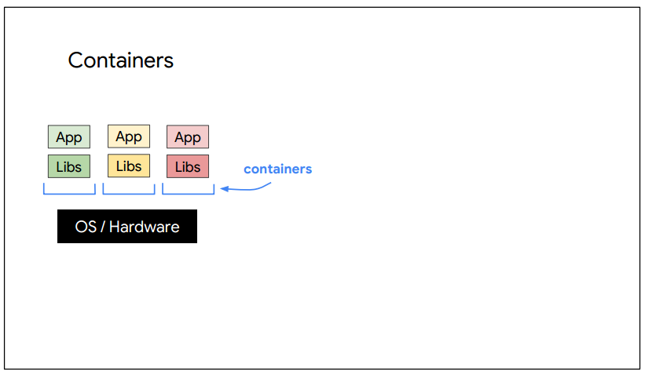

# 05 Containers in the Cloud

## Container
Virtual Machine
- Hadrware 를 추상화
- OS 가 개별로 존재
- Pros
  - 각기 원하는 설정으로 환경 구성 가능
- Cons
  - 불필요하게 OS 마다 차지하는 디스크, 메모리 크기가 큼
  - 부팅 시간이 오래 걸림
 

 
No more VMs..
- VM 에서 동작하는 서비스가 늘어난다면?
- 늘어나는 서비스 마다 VM 를 추가할 것인가?
- 비용은 증가하고, 속도는 느려짐
 

 
App Engine
- self-contained workload
- 자기 자신만의 서비스를 구성하고 관련된 libraries 존재
 

 
Container
- Container 는 PaaS 에서 독립적이고 확장 가능한 workloads
- IaaS 환경에서 OS 과 H/W 를 추상화
- process 로 동작. 실행속도 빠름
 

## Kubernates
 
 
Kubernates
- 수 많은 containers 를 조직화(orchestrate)해서
- microservices 로 scale 하고
- rollout 과 rollback 배포함
- open-source orchestrator
  - 상위 레벨로 containers 를 추상화
  - applications 을 관리하고 scale 함
 

Cluster
- 최상위 레벨에서, cluster 라고 불리는 nodes 집합에 containers 를 배포할 수 있음
- master
  - cluster 에서 containers 를 동작시키는 nodes 를 관리하는 컴포넌트
  - node 는 machine 같은 computing instance 로 표현됨
- Google Cloud 에서 nodes 는 Compute Engine 에서 동작하는 virtual machines 임
- container 를 빌드해서 cluster 에 배포할 수 있음
 

Kubernates Engine or GKE(Google Kubernates Engine)
 

 
Pod
- 한 개 이상의 containers 를 wrapping 한 것을 Pod
- 이 Pod 을 nodes 에 배포
- Pod 은 kubernates 에서 생성하고 배포하는 가장 작은 단위
- cluster 에서 동작하는 프로세스로 표현됨
- 일반적으로 pod 하나 당 하나의 container 를 가짐
- 유일한 네트워크 IP 와 ports 가짐
- pod 내부의 containers 는 localhost 와 ports 로 통신
 

 
Service
- Pods 을 그룹화하는 논리적인 개념
- Pods 의 endpoint(or fixed IP) 역할
- Load Balancer 로 들어오는 트래픽은 service 를 통해서 pods 에 전달
 