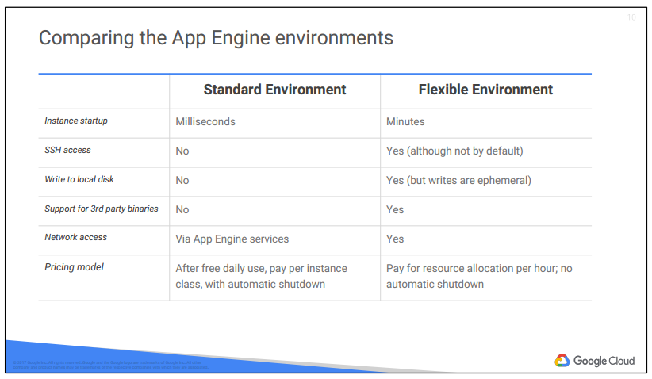

# 06 Applications in the Cloud
  

## Google App Engine
App Engine 은 Paas
- 확장 가능한 web applications / mobile backends 를 구축하기 위한 플랫폼
- Hardware, network 인프라를 관리해줌
- built-in 서비스 & APIs 제공
  - NoSQL datastore
  - memcache
  - load balancing
  - health check
  - app logging
  - user authentication
  - and more..
- 트래픽에 따라서 자동으로 scale 해줌

Security Canner
- web application 취약점을 자동으로 분식 & 탐지
  

## Google App Engine Standard Environment
App Engine Standard Environment
- container instances 에 동작
- 다양한 runtime 제공
  - Java 7, Python 2.7, Go, PHP

 
  

## Google App Engine Flexible Environment
web app은 Compute Engine VMs 에서 Docker Containers 에서 동작함
App Engine 은 이 Compute Engine VMs 을 관리함
- health check
- 복구
- 지리적 region 선택하여 동작
- 하위 호환성 업데이트

그리고 지원하는 것들
- Microservices
- Authorization
- SQL
- NoSQL
- traffic splitting
- logging
- search
- versioning
- security scanning
- memcache
- content delivery networks

지원하는 runtimes
- Java 8/Servlet 3.1/Jetty 9
- Python 2.7
- Python 3.4
- Node.js
- Go
- Ruby
- PHP

### Standard vs. Flexible environment
 
  

### Kubernates Engine vs. App Engine
 

## Google Cloud Endpoints and Apigee Edge
Cloud Endpoints 
- 분산형 API 관리 시스템
- API 콘솔, 호스팅, 로깅, 모니터링 등을 제공
- features
  - User authentication
  - Automated deployment
  - Logging and monitoring
  - API keys
  - Easy integration

Apigee
- API proxies 를 개발하고 관리할 수 있는 플랫폼
- rate limit, quotas, analytics 에 중점을 둠

  

