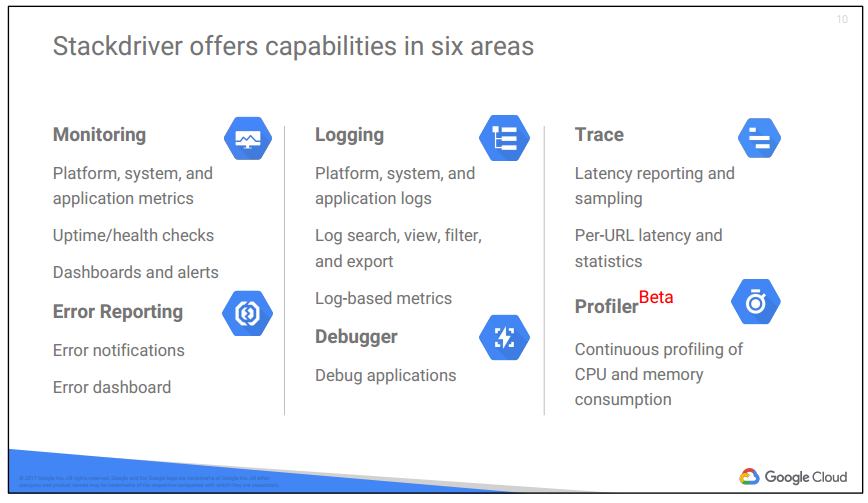

# 07 Developing, Deploying, and Monitoring in the Cloud

## Development in the cloud
Cloud Source Repositories
- git 지원
- runtime 에 debugging 지원
- Debugger, Error Reporint
  - 에러 발생 시 코드 레벨로 tracking 해줌

Cloud Funtion
- cloud events 에 응답할 수 있는 단순 목적의 function
  - lightweight
  - event-based
  - asynchronous
- Javascript 로 구현
- GCP 에서 Node.js 로 구동됨
- e.g. Cloud Storage 혹은 Cloud pub/sub 에서 발생하는 events 가 Cloud Functions 을 비동기적으로 trigger 함
- 혹은 HTTP 호출을 동기적으로 실행

Cloud Events
- cloud 에서 발생하는 것
- e.g. database 에서 데이터 변경
- e.g. storage 시스템에 파일 추가
- e.g. virtual machine 인스턴스 생성

Trigger
- 내가 처리하려는 관심있는 event 를 정의하는 것
  

## Deployment : Infrastructure as code
Deployment Manager
- 인프라 관리 서비스
  - GCP 리소스를 생성하고 관리하는 것을 자동화
  - 템플릿 파일; YAML or python 
  - 
  

## Monitoring : Proactive instrumentation
 
 
Stackdriver
- monitoring, logging, diagnostic 툴
- features
  - monitoring
  - logging
  - trace
  - error reporting
  - debugger
  - profiler
  
