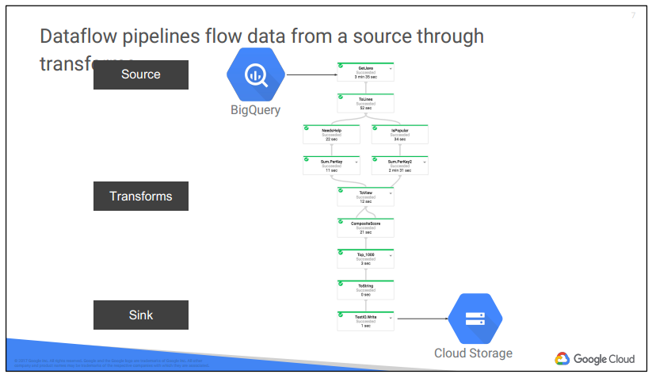
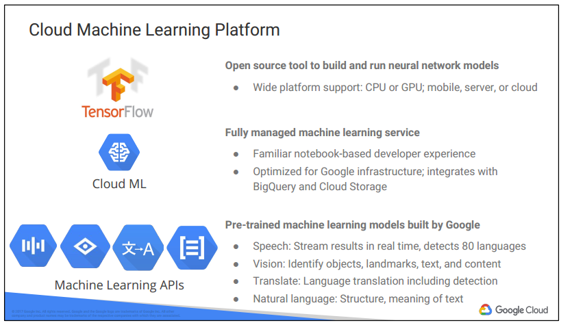

# 08. Big Data and Machine Learning in the Cloud

## Google Cloud Big Data Platform
- Serverless platform
  - jobs 을 실행하기 위해 compute instances 를 provision 할 필요 없음
- Fully managed & scalable services
  - Cloud Dataproc
    - Managed Hadoop, MapReduce, Spark, Pig, Hive
  - Cloud Dataflow
    - Stream and batch 처리
    - 파이프라인 통합과 단순화
  - BigQuery
    - Analytics database
    - stream data at 100,000 rows/s
  - Cloud Pub/Sub
    - 확장 가능하고 유연한 엔터프라이즈급 메세징 서비스
  - Cloud Datalab
    - interactive data exploration
 

### Cloud Dataproc
- Hadoop, Spark, Hive, Pig 를 GCP 에서 동작시킴
- Hadoop
  - open-source big data platform
  - MapReduce programming model
    - "map" function
      - 대용량 데이터 세트를 병렬로 처리해서 중간 결과를 생성
    - "reduce" function
      - 중간 결과를 토대로 최종 결과 세트를 생성
  - Hadoop 이란 용어
    - Apache Hadoop 와 그리고 관련된 프로젝트들(Apache Spark, Apache Pig, Apache Hive) 를 아우러서 부르기도 함
 

### Why Cloud Dataproc?
- on-premises 에서 구성하려면 H/W 리소스도 직접 구성해야 함
- GCP 는 H/W 리소스 모두 구성해줌. 돈만 내면 됨
- batch 처리를 할 때 preemptible Computue Engine instance 를 사용하면 비용 절감할 수 있음
  - 80% 정도 저렴
- 데이터가 cluster 에 있다면, Spark, SparkSQL 로 데이터 마이닝 가능
- MLlib(Apache Spark Machine Learning Libraries) 도 사용 가능
 

### Cloud Dataflow
- 통합된 프로그래밍 모델과 관리형 서비스
- 데이터가 실시간이고 데이터 크기나 속도를 알 수 없을 때 사용
    - Cloud Dataproc 은 데이터 크기를 이미 알고 있고, cluster 크기를 관리할 때 사용함
- 큰 범위의 데이터 처리 패턴을 개발하고 실행할 때
  - ETL(extract-transform-and-load)
  - batch computation
  - continuous computation
- 데이터 파이프라인을 만들 수 있고
- 이 파이프라인을 데이터 배치와 스트리밍에 적용
- features
  - Resource Management
    - 필요한 리소스를 완전 자동화하여 관리해줌
  - On Demand
    - 필요할 때 리소스를 가져다 쓸 수 있음
    - 미리 compute instances 살 필요 없음
  - Intelligent Work Scheduling
    - 자동화 & 최적화 스케줄링
  - Auto Scaling
    - 최적화된 처리량을 위해 리소스 자동 scaling
  - Unified Programming Model
    - MapReduce like 한 API 제공
  - Open Source
  - Monitoring
    - throughput, lag 같은 통계 모니터링; 거의 실시간
  - Integrated
    - 다른 GCP Big Data 서비스와 연동
  - Reliable & Consistent Processing
 

 
### Dataflow piplines
- source
  - BigQuery 테이블에서 데이터를 읽음
- transforms
  - 데이터 처리; map & reduce
- sink
  - Cloud Storage 에 결과를 쓰기
 

### Why Cloud Dataflow?
- ETL tool
- Data analysis
- Orchestration
- Integrated with GCP services
 

### BigQuery
- 동적 파이프라인 대신에, 대용량 데이터에 ad-hoc SQL 쿼리를 실행하고 싶을 때 사용
- 완전 관리형 데이터 웨어하우스
  - 완전 관리형
  - petabytes 규모
  - 저렴한 빅데이터 분석 플랫폼
  - NoOps
    - no infrastructure
    - 데이터베이스 관리자 필요 없음
- features
  - Flexible Data Ingestion
    - 초당 100,000 rows 만큼을
    - Cloud Storage, Cloud Datastore 에 적재하거나
    - BigQuery 에 스트림할 수 있고
    - 실시간으로 데이터 분석이 가능함
  - Global Availability
  - Security and Permissions
  - Cost Controls
  - Highly Available
    - multi-geographies 에 데이터 복재
  - Super Fast Performance
    - terabytes 데이터에 SQL 쿼리를 초당 아주 빠르게 실행할 수 있음
  - Fully Integrated
  - Connect with Google Products
 

### Cloud Pub/Sub
- 확장 가능하고 신뢰성 있는 실시간 메세징 서비스
  - 최소 한 번은 전송 보장 w/ low-latency
  - 초당 1 million 메세지까지 on-demand 확장
  - many-to-many 비동기 메세징
  - topic 에 push/pull subscriptions
  - Cloud Dataflow 와 연동 가능
- features
  - Highly Scalable
    - 기본 초당 10,000 개, 최대 초당 1,000,000 개 메세지 전송 가능
  - Push and Pull Delivery
  - Encryption
    - 모든 메세지는 암호화
  - Replicated Storage
    - 최소 한 번 전송은 보장; at least once
  - Message Queue
    - 싱글 topic 을 사용한 확장 가능한 메세지 큐
    - one-to-one 통신 패턴 지원하는 subscription
  - End-to-End Acknowledgement
  - Fan-out
    - topic 에 publish 하면 다수의 subscribers 가 수신할 수 있음
    - one-to-many, many-to-many 통신 지원
  - REST API
    - JSON 메세지 포맷을 사용한 단순하고 stateless 인터페이스 
- use cases
  - 데이터가 빠르고 예측할 수 없는 속도로 사용되는 경우
    - Internet of Things(IoT)
    - Marketing Analytics
  - Cloud Dataflow 로 스트리밍 데이터 분석

### Cloud Datalab
- Jupyter notebooks 을 사용한 interactive tool
  - data exploration
  - transformation
  - analysis
  - visualization
 

## Google Cloud Machine Learning Platform
 
- TensorFlow
  - open source tool
- Cloud ML
  - 완전 관리형 기계 학습 서비스
- Machine Learning APIs
  - 이미 학습된 기계 학습 모델
 

### Why Cloud Machine Learning Platform?
- For structured data
  - classification, regression
    - 고객 이탈 분석, 제품 진단, 예측
  - Recommendation
    - 컨텐츠 개인화 추천
    - cross-sells
      - 이미 고객에 구매한 제품을 보완하거나 보충하는 제품을 추천
    - up-sells
      - 신규 서비스를 추가하거나 더 비싼 제품을 구매하도록 추천
  - 비정상 탐지
    - 사기 탐지
    - 센서 진단
    - 로그 계측
- For unstructured data
  - 이미지 분석
    - 선박 손상 분석
    - 스타일 분석
    - 컨텐츠 신고
  - 텍스트 분석
    - 콜 센터 로그 분석
    - 언어 식별
    - 주제 분류
    - 구문 분석
 

### Cloud Vision API
- REST API 를 사용한 이미지 분석
  - 로고 탐지, 레이블 탐지
- You can
  - 이미지 분류
  - 이미지 안에 객체 식별
  - 이미지 안에 글자 검색 및 분석
  - 공격적/불건전 컨텐츠 탐지
  - 정서 감지
 

### Cloud Speech API
- 80 개 이상 언어 인식
- 실시간 텍스트 변환(speech to text)
 

### Cloud Natural Language API
- 자연어 처리 
- 구문 분석
- 명사, 동사, 형용사, 언어의 구문 분석
- 다른 언어와 관계 파악
- features
  - Syntax Analysis
  - Entity Recognition
  - Sentiment Analysis
  - Multi-Language
  - Integrated REST API
 

### Cloud Translation API
- 번역 서비스
- 문서의 언어 탐지
- 다양한 언어의 Client libraries 제공
  - Python, Java, Ruby, Objective-C, 등등
 

### Cloud Video Intelligence AP
- REST API 제공
- 비디오 내용에 주석 달기
  - frame-level(1fps) 지원
- 장면 전환 탐지
- 부적절 컨텐츠 flagging
- 다양한 비디오 포맷 지원
  - MOV, MPEG4, MP4, AVI
 